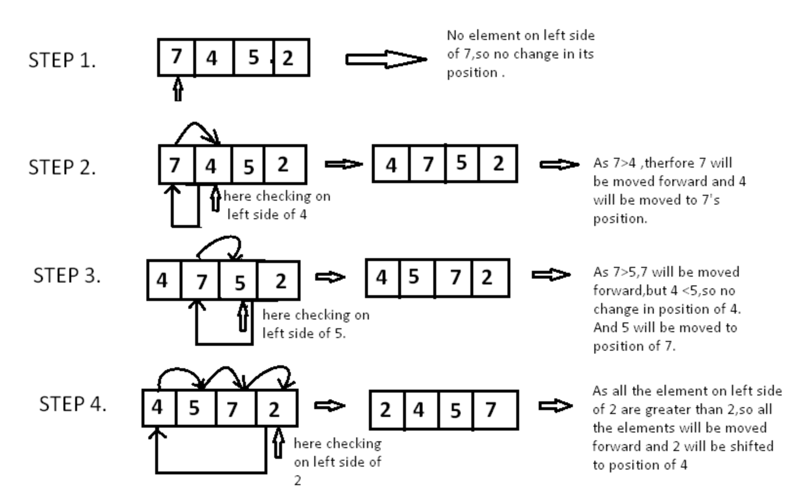

# Blog Notes: Insertion Sort
Insertion sort is the simplest and efficient sorting algorithm for small number of elements.

Insertion sort algorithm iterates, consuming one input element each repetition, and growing a sorted output list. Each iteration removes one element from the input data, finds the location it belongs within the sorted list, and inserts it there. It repeats until no input elements remain.

Insertion sort is based on the idea that one element from the input elements is consumed in each iteration to find its correct position i.e, the position to which it belongs in a sorted array.

Insertion sort runs in O(n²), or quadratic, time in the worst case. This typically isn’t very effective and should not be used for large lists. Because of insertion sort’s low hidden constant value, however, it usually outperforms more advanced algorithms such as quick sort or merge sort on smaller lists. 

# Learning Objectives
* What is insertion sort
* What does it do
* Efficiency
* How it works
* What the code looks like

# Information Flow
*Main Point
  *Supporting Points

*Another main point
  *More details
  *Go here

# Diagram

# Algorithm

Pseudocode

  InsertionSort(int[] arr)
  
    FOR i = 1 to arr.length
    
      int j <-- i - 1
      int temp <-- arr[i]
      
      WHILE j >= 0 AND temp < arr[j]
        arr[j + 1] <-- arr[j]
        j <-- j - 1
        
      arr[j + 1] <-- temp

Implemented a nested for while loop where the outer loop iterates over the array at i for the length of the array and the inner loop iterates over the array at j from right to left as j is decremented.  i starts at index 1 and j at 0, always one position behind.  A variable called temp is declared and set to the value at i so that when the swap takes place the temp value is referenced.  The value at i(temp) and j are compared in the while condition.  If true it keeps comparing to it's left value at j as j is decremented until temp is greater and breaks out of the while loop and temp finds its new location.  This repeats as i increments to the length of the array and the ouput is sorted numerically.

# Readings and References

Watch
  * [Youtube.com Insertion Sort](https://www.youtube.com/watch?v=0KQyyZatDgM)

Read
  * [Javascript Algorithms — Insertion Sort](https://medium.com/javascript-algorithms/javascript-algorithms-insertion-sort-59b6b655373c)
  
  * [Insertion Sort Algorithm](http://blog.benoitvallon.com/sorting-algorithms-in-javascript/the-insertion-sort-algorithm/)

Bookmark
  * [Big O Cheat Sheet](https://www.bigocheatsheet.com/)
  * [Visualgo](https://visualgo.net/en/sorting)

  