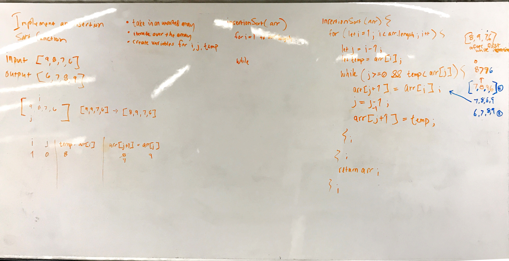

# Code Challenge 26: Insertion Sort

# Authors
Brad Smialek

## Challenge Summary
Complete a working, tested implementation of Insertion Sort, based on the pseudo code provided

## Challenge Description

InsertionSort(int[] arr)
  
    FOR i = 1 to arr.length
    
      int j <-- i - 1
      int temp <-- arr[i]
      
      WHILE j >= 0 AND temp < arr[j]
        arr[j + 1] <-- arr[j]
        j <-- j - 1
        
      arr[j + 1] <-- temp

## Approach & Efficiency

Implemented a nested for while loop where the outer loop iterates over the array at i for the length of the array and the inner loop iterates over the array at j from right to left as j is decremented.  i starts at index 1 and j at 0, always one position behind.  A variable called temp is declared and set to the value at i so that when the swap takes place the temp value is referenced.  The value at i(temp) and j are compared in the while condition.  If true it keeps comparing to it's left value at j as j is decremented until temp is greater and breaks out of the while loop and temp finds its new location.  This repeats as i increments to the length of the array and the ouput is sorted numerically.

Time Complexity: O(n*2)

Space: O(1)

Time complexity
O(n)
Space complexity

//Constant runtime 
//Big O notation: "O (1)"

//Linear runtime
//Big O notation: "O (n)"

//Exponential runtime
//Big O notation: "O (n^2)"

## Solution

