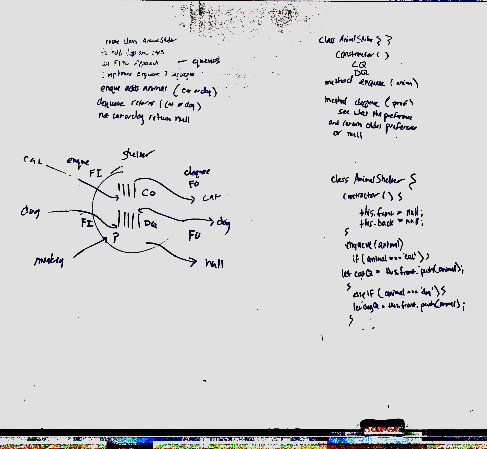

# Code Challenge 12

## Authors
Brandyn Vay, Brad Smialek

## Challenge
  * Create a class called AnimalShelter which holds only dogs and cats. The shelter operates using a first-in, first-out approach.
  
### Approach & Efficiency
<!-- What approach did you take? Why? What is the Big O space/time for this approach? -->

Time complexity
O(n)
Space complexity

//Constant runtime 
//Big O notation: "O (1)"

//Linear runtime
//Big O notation: "O (n)"

//Exponential runtime
//Big O notation: "O (n^2)"

### Solution
