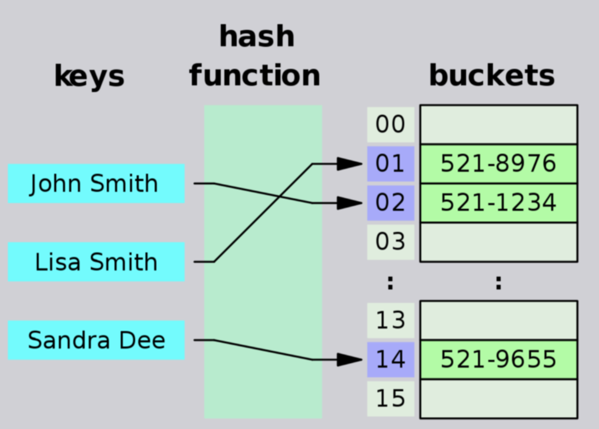

# DSA Implementation: Hash Tables

# Authors
Brad Smialek

# Challenge Summary
* Implement a Hashtable

 

 

## Challenge Description
* Implement a Hashtable with the following methods:

  * add: takes in both the key and value. This method should hash the key, and add the key and value pair to the table, handling collisions as needed.
  * get: takes in the key and returns the value from the table.
  * contains: takes in the key and returns a boolean, indicating if the key exists in the table already.
  * hash: takes in an arbitrary key and returns an index in the collection.

## Approach & Efficiency

//Constant runtime 
//Big O notation: "O (1)"

## API

* Class Hash
 * add
 * get
 * contains
 * hash

## Solution
