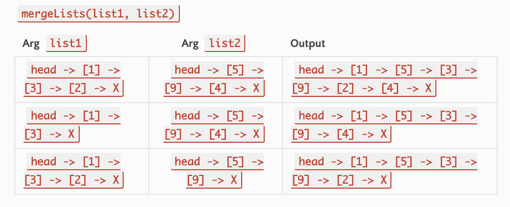

# Code Challenge 8: Linked List(Merge)

# Authors
Brad Smialek

# Challenge Summary
Merge two linked lists

## Challenge Description
Write a function called mergeLists which takes two linked lists as arguments. Zip the two linked lists together into one so that the nodes alternate between the two lists and return a reference to the head of the zipped list. Try and keep additional space down to O(1). You have access to the Node class and all the properties on the Linked List class as well as the methods created in previous challenges.

## Approach & Efficiency
<!-- What approach did you take? Why? What is the Big O space/time for this approach? -->

Time complexity
O(n)
Space complexity

//Constant runtime 
//Big O notation: "O (1)"

//Linear runtime
//Big O notation: "O (n)"

//Exponential runtime
//Big O notation: "O (n^2)"

## Solution
