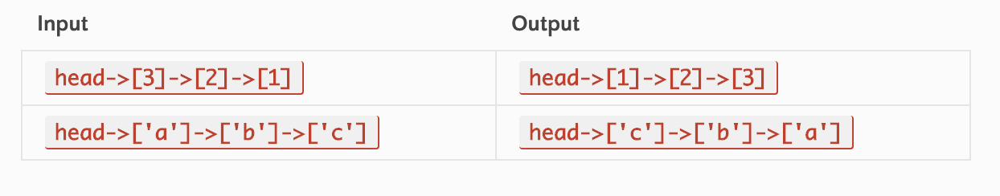

# Code Challenge 9 - Interview

## Authors
Brandyn Vay, Brad Smialek

## Challenge Summary
write a function to reverse a Singly Linked List

## Challenge Description
This problem can be approached in several ways:
Iterating over the linked list and storing a reference to a current node, its previous node, and its next node.
In every iteration, after the next node is stored, the current’s node next pointer is pointed at the stored reference to the previous node.
This solution takes O(n) time and uses O(1) extra space.
A recursive solution that reverses the body of the link list before re-connecting the head.
This solution takes O(n) time and uses O(n) space on the call stack.
Creating a copy of the linked list, inserting elements at the head of the new list.
This solution takes O(n) time and uses O(n) space.

  
### Approach & Efficiency
<!-- What approach did you take? Why? What is the Big O space/time for this approach? -->

Time complexity
O(n)
Space complexity

//Constant runtime 
//Big O notation: "O (1)"

//Linear runtime
//Big O notation: "O (n)"

//Exponential runtime
//Big O notation: "O (n^2)"

### Solution
