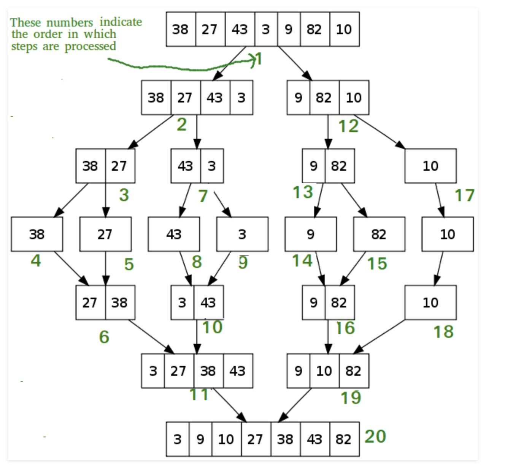

# Code Challenge 27: Merge Sort

# Authors
Brad Smialek

## Challenge Summary
Complete a working, tested implementation of Merge Sort, based on the pseudo code provided

## Challenge Description

ALGORITHM Mergesort(arr)
    DECLARE n <-- arr.length
           
    if n > 1
      DECLARE mid <-- n/2
      DECLARE left <-- arr[0...mid]
      DECLARE right <-- arr[mid...n]
      // sort the left side
      Mergesort(left)
      // sort the right side
      Mergesort(right)
      // merge the sorted left and right sides together
      Merge(left, right, arr)

ALGORITHM Merge(left, right, arr)
    DECLARE i <-- 0
    DECLARE j <-- 0
    DECLARE k <-- 0

    while i < left.length && j < right.length
        if left[i] <= right[j]
            arr[k] <-- left[i]
            i <-- i + 1
        else
            arr[k] <-- right[j]
            j <-- j + 1
            
        k <-- k + 1

    if i = left.length
       set remaining entries in arr to remaining values in right
    else
       set remaining entries in arr to remaining values in left

## Approach & Efficiency

So how do you sort a list with merge sort, how does this algorithm work? It all revolves around the idea that it’s easier to sort two sorted arrays rather than one unsorted one. Once we have our two sorted arrays we start comparing their items one by one and adding the smaller item in our result list. Imagine that you’ve got two lists A and B. You compare A[0] to B[0]. Let’s say that A[0] is smaller — we add it to the result list and continue. Then we compare A[1] to B[0]. This time B[0] is the smaller one so we add it and continue comparing A[1] to B[1] and so on…

At the end of the sorting any left variables are concatenated at the end of our results list — since the A and B arrays are already sorted this will not cause reordering.

Best	          Average	       Worst
O(n log(n))	  O(n log(n))	    O(n log(n))

## Solution

