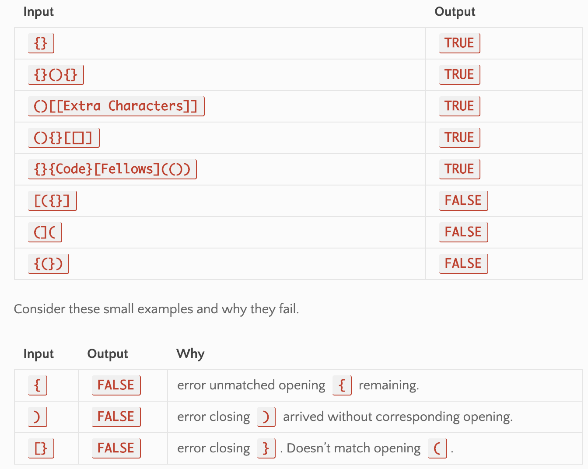
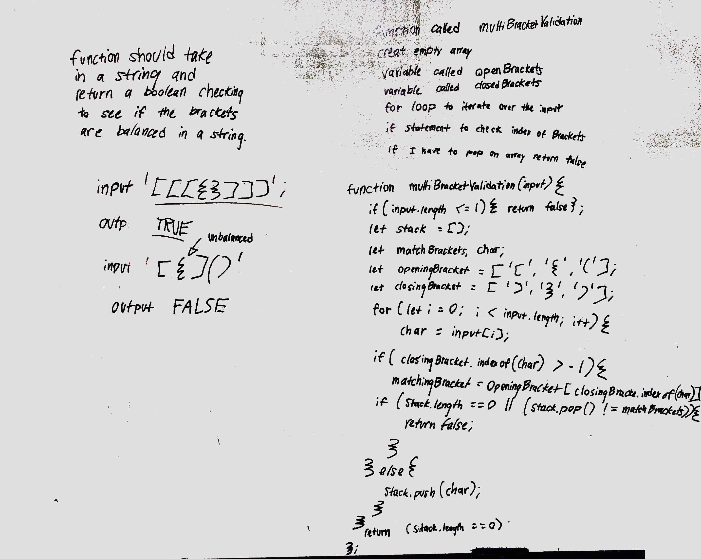

# Code Challenge 13: MULTI-BRACKET VALIDATION
 
# Authors
Brad Smialek and Brandyn Vay

## Challenge Summary
Multi bracket validation

## Challenge Description
Your function should take a string as its only argument, and should return a boolean representing whether or not the brackets in the string are balanced. There are 3 types of brackets:

Round Brackets : ()
Square Brackets : []
Curly Brackets : {}

## Approach & Efficiency
I iterate over the length of the string with for loop.  I identify opening brackets by using modulus. If the brace was an opening brace its index position would be even and pushed to the stack. If not then pop() if the bracket position doesn't match the popped integer then it's unbalanced.  If empty then returns true
Time complexity
O(n)
Space complexity

//Constant runtime 
//Big O notation: "O (1)"

//Linear runtime
//Big O notation: "O (n)"

//Exponential runtime
//Big O notation: "O (n^2)"

## Solution

