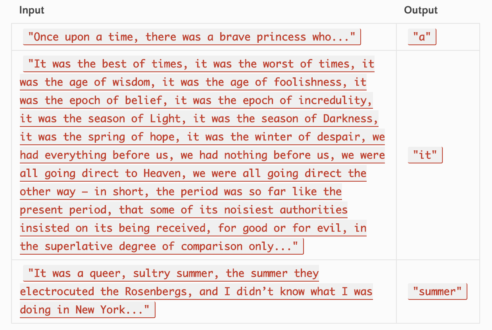

# Code Challenge 31: Repeat Word

# Authors
Brad Smialek

# Challenge Summary
* Find the first repeated word in a book.

 

 

## Challenge Description
* Write a function that accepts a lengthy string parameter.
* Without utilizing any of the built-in library methods available to your language, return the first word to occur more than once in that provided string.
* Utilize the Single-responsibility principle: any methods you write should be clean, reusable, abstract component parts to the whole challenge.
* Write at least three test assertions for each method that you define.

## Approach & Efficiency

//Constant runtime 
//Big O notation: "O (1)"

## ??
* Import node.js model
* Class Queue
 * enqueue
 * dequeue
 * peek

* Class Stack
 * push
 * pop
 * peek

## Solution

## Stretch Goals
* Modify your function to return a count of each of the words in the provided string
* Modify your function to return a list of the words most frequently used in the provided string