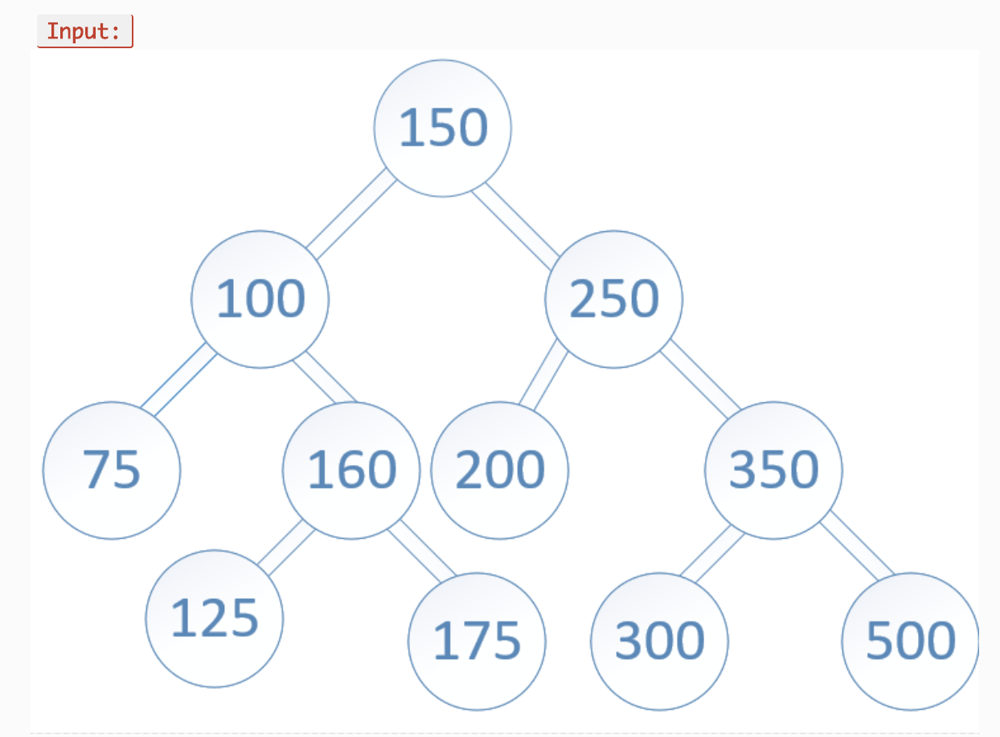
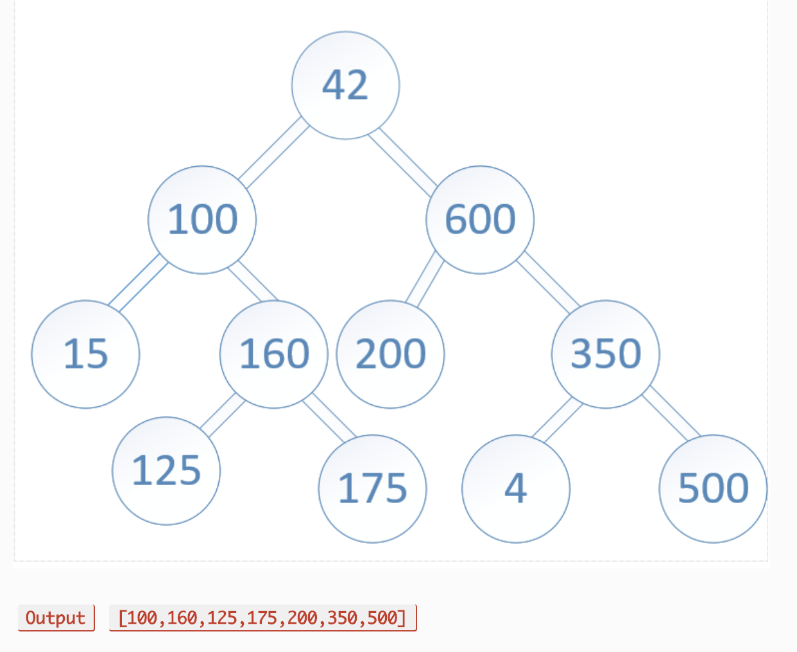

# Code Challenge 32: Tree Intersection

# Authors
Brad Smialek

# Challenge Summary
* Find common values in 2 binary trees.

 

 

## Challenge Description
* Write a function called tree_intersection that takes two binary tree parameters.
* Without utilizing any of the built-in library methods available to your language, return a set of values found in both trees.

## Approach & Efficiency

//Constant runtime 
//Big O notation: "O (1)"

## ??
* Import node.js model
* Class Queue
 * enqueue
 * dequeue
 * peek

* Class Stack
 * push
 * pop
 * peek

## Solution
